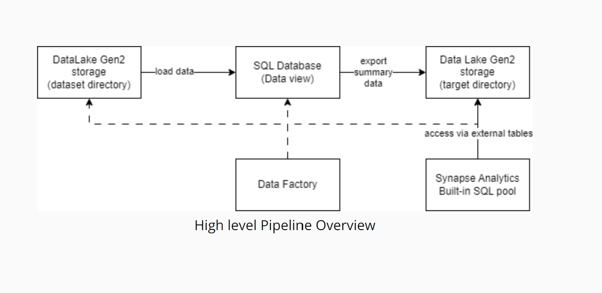

# Data Integration Pipelines for NYC Payroll Data Analytics

## Project Overview

The City of New York would like to develop a Data Analytics platform on Azure Synapse Analytics to accomplish two primary objectives:

Analyze how the City's financial resources are allocated and how much of the City's budget is being devoted to overtime.
Make the data available to the interested public to show how the City’s budget is being spent on salary and overtime pay for all municipal employees.

### Project Goal

The goal is to create high-quality data pipelines that are dynamic, can be automated, and monitored for efficient operation. At the high level the pipelines looks like below:

### Project Steps

#### Step 1. Prepare the Data Infrastructure

    1. Create the data lake and upload data

        
        
    
    2. Create SQL Database

        
    
    3. Create a Synapse Analytics workspace and Azure Data Factory

        
    
#### Step 2: Create Linked Services

    1. Create a Linked Service for Azure Data Lake and SQL Database

        

#### Step 3: Create Datasets in Azure Data Factory

    1. Create the datasets

        
    
#### Step 4: Create Data Flows

    1. Create Dataflows

        
    
    2. Create Data Aggregation and Parameterization dataflow

        

#### Step 5: Pipeline Creation

    1. Create Pipeline

        

    2. Trigger and Monitor Pipeline

        

    3. Verify Pipeline run artifacts

        
        
        
    

